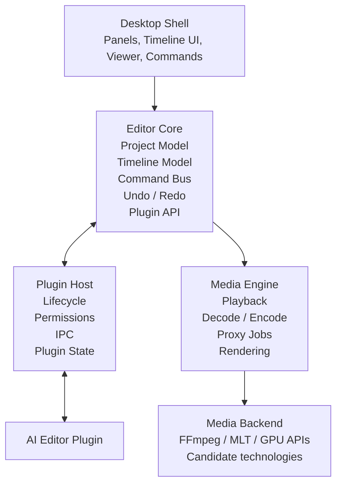
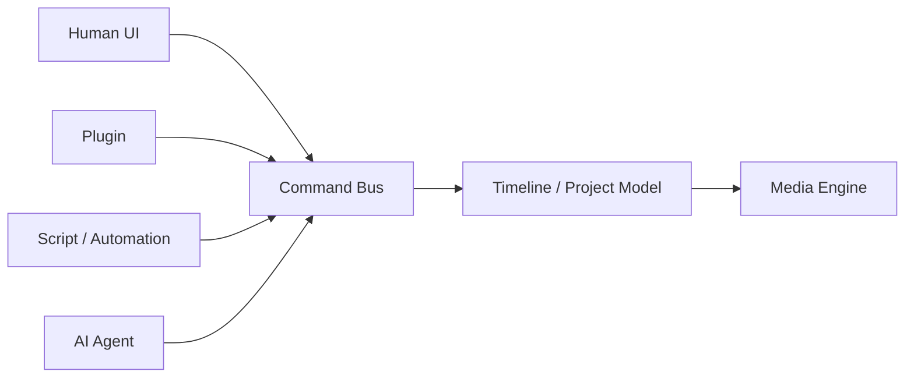

# MVP Architecture

Status: **Draft / Canonical**

This document defines the high-level architecture for the first usable version of Open Video Editor.

## Architecture



## Primary components

### Desktop shell

Responsible for the native application window and the editor's default interface. The shell should consume the same public editor capabilities exposed to sufficiently privileged plugins wherever practical.

### Editor core

The source of truth for editing state. It owns:

- projects
- sequences
- tracks
- clips
- timeline state
- command execution
- undo and redo history
- editor events
- plugin-facing APIs

The core must not depend on the AI plugin.

### Command bus

All mutations of editing state should occur through commands rather than arbitrary direct state mutation.

Examples:

```text
SplitClip
TrimClip
MoveClip
InsertClip
DeleteRange
RippleDelete
ApplyEffect
SetClipProperty
```

The command layer is shared by the built-in UI, plugins, automation, and AI workflows.



This is a core architectural invariant.

## Media engine

The media engine provides playback, decoding, encoding, proxy generation, timeline rendering, and export.

We should avoid implementing codec infrastructure ourselves unless required. FFmpeg, MLT, GStreamer, and platform GPU APIs are candidates to evaluate. The MVP architecture deliberately does not commit to one yet.

## Process boundaries

Plugins should not automatically execute inside the editor core process. The plugin host should provide isolation so that a plugin crash does not necessarily crash the editor.

The exact process model remains an architecture decision to validate during prototyping.

## MVP boundaries

### Included

- local project files
- media import
- timeline model
- basic video/audio editing
- playback
- basic transforms
- basic audio controls
- undo/redo
- rendering/export
- plugin discovery and lifecycle
- plugin UI surfaces
- plugin command/event APIs
- background jobs
- first AI plugin

### Explicitly not required for MVP

- professional color pipeline parity with Resolve
- Fusion-style compositing
- full DAW
- multicam editing
- collaborative cloud projects
- plugin marketplace
- mobile clients
- broad codec implementation written by the project

These may eventually exist as core capabilities or plugins, but they should not block validating the architecture.

## Architectural test

The MVP architecture succeeds if a third party can build a substantial editing workflow without modifying editor-core source code.

A useful test is whether the first AI editor plugin feels like a small application running inside Open Video Editor rather than a thin integration bolted onto it.
