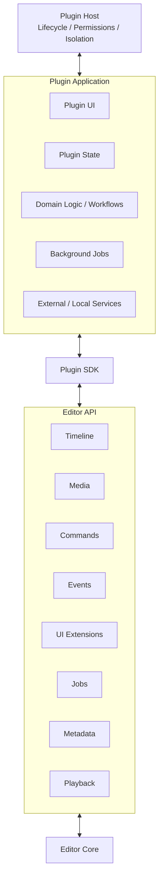

# Plugin Runtime

Status: **Draft / Canonical**

Plugins are first-class applications hosted by Open Video Editor, not merely effects or sidebar widgets.

## Principle

> Plugins extend the editor, but do not bypass it.

A plugin may own substantial functionality, but changes to projects and timelines must flow through stable editor APIs and the command system.

## Plugin model



## What a plugin can own

A plugin may:

- register one or more panels
- provide custom editing interfaces
- maintain its own persistent state
- register commands and shortcuts
- subscribe to editor events
- start and monitor background jobs
- read project/media metadata when permitted
- invoke local binaries and models when permitted
- communicate with cloud services when permitted
- request editor commands that mutate a project
- package an entire specialized workflow

This allows a podcast editor, color workflow, subtitle environment, or AI editing system to feel like its own application while sharing the same editing kernel.

## Capability-based API

The SDK should be organized around capabilities rather than exposing editor internals.

Conceptual example:

```ts
editor.timeline.getActiveSequence()
editor.timeline.getSelection()

editor.commands.execute({
  type: "timeline.rippleDelete",
  range: { start, end }
})

editor.media.getMetadata(mediaId)
editor.events.on("selection.changed", callback)
editor.ui.registerPanel(panelDefinition)
editor.jobs.create(jobDefinition)
```

The exact language and API shape are not yet decided. TypeScript is used here only to communicate the model.

## Permissions

Plugins should explicitly declare privileged capabilities.

Conceptual manifest:

```yaml
id: org.example.ai-editor
name: AI Editor
version: 0.1.0

permissions:
  - project.read
  - timeline.read
  - timeline.write
  - media.read
  - jobs.create
  - filesystem.project

network:
  optional: true
```

Potential permission families:

- `project.read`
- `project.write`
- `timeline.read`
- `timeline.write`
- `media.read`
- `filesystem.project`
- `filesystem.external`
- `network`
- `process.spawn`
- `models.local`

The permission system should make local-only plugins enforceable rather than merely conventional.

## Isolation

A plugin should not be able to corrupt editor state by mutating core objects directly. The plugin host should mediate access to the editor.

Desired properties:

- plugin crashes can be contained
- expensive plugin work cannot block playback/UI threads
- permissions can be enforced
- plugin lifecycle can be managed independently
- plugin APIs can be versioned

Whether plugins use processes, WASM, IPC, or another mechanism is intentionally unresolved.

## UI extension model

Plugins should be able to provide more than one panel. A plugin may effectively define a workspace.

Examples:

```text
Podcast Plugin
├── Transcript
├── Speaker Inspector
├── Camera Switcher
├── Audio Cleanup
└── Export Presets
```

or:

```text
AI Editor
├── Assistant
├── Transcript
├── Edit Plan
├── Search
└── Model Settings
```

This is central to the architecture. We should not design the plugin API around the assumption that plugins are small.

## Versioning

The public plugin API must be versioned independently from internal editor implementation. Internal refactors should not unnecessarily break plugins.

A compatibility policy will be defined before the SDK is considered stable.
