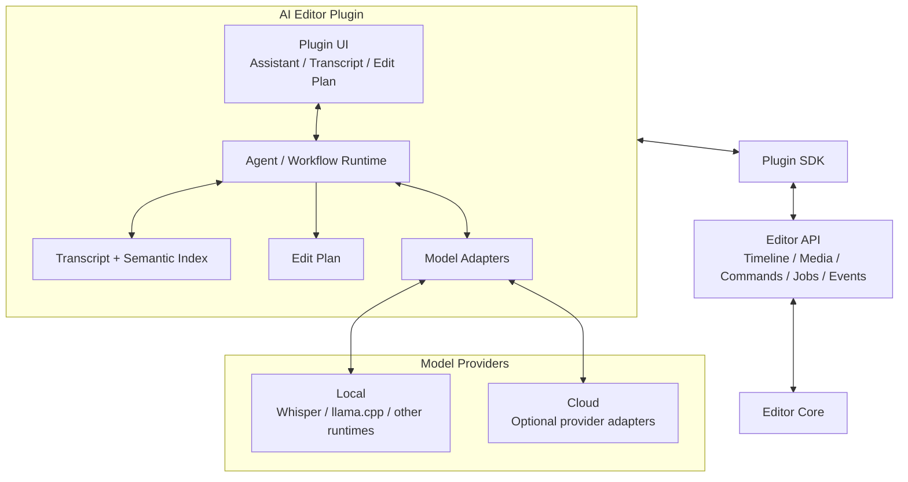
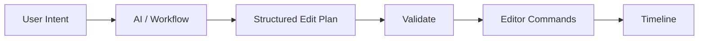

# AI Editor Plugin

Status: **Draft / Canonical**

The AI Editor is the first flagship plugin and the primary test of the plugin architecture.

It should demonstrate that a plugin can behave like an application inside Open Video Editor.

## Goals

The plugin should:

- support local AI workflows
- optionally support cloud model providers
- never require cloud infrastructure
- interact with projects through the public editor API
- produce inspectable edit plans before or while modifying a timeline
- use normal editor commands for mutations
- preserve undo/redo behavior
- allow humans to refine AI-created edits normally

## Architecture



## Local-first model architecture

The plugin should depend on capabilities rather than a single AI vendor.

Examples:

```text
speech-to-text
text-generation
embeddings
vision
speaker-diarization
```

A workflow requests a capability. A configured provider satisfies it.

For example:

```text
speech-to-text
├── local Whisper runtime
└── optional cloud provider

text-generation
├── llama.cpp-compatible local model
└── optional cloud provider
```

Specific providers are implementation choices, not architectural dependencies.

## Edit plans

The model should not receive unrestricted access to mutate editor state.

AI reasoning should produce a structured edit plan that can be validated and translated into editor commands.

Conceptual example:

```json
{
  "goal": "remove long silences",
  "operations": [
    {
      "operation": "ripple_delete",
      "start": 12.42,
      "end": 14.18,
      "reason": "silence exceeds configured threshold"
    }
  ]
}
```

The plugin translates valid operations into commands supported by the editor core.



## Non-destructive workflow graph

Longer AI workflows should be represented as understandable steps rather than opaque actions.

Example:

```text
Create Interview Rough Cut
├── Transcribe media
├── Identify requested topic
├── Find relevant segments
├── Rank candidate segments
├── Remove repeated statements
├── Create assembly
└── Normalize pauses
```

The long-term goal is for steps to be inspectable, configurable, disableable, and rerunnable.

## First scope

The first plugin version should focus on transcript editing rather than general-purpose autonomous editing.

Initial capabilities:

- transcribe selected media
- show timestamped transcript
- navigate video from transcript
- remove transcript ranges from timeline
- search transcript semantically
- generate a rough cut from a natural-language goal
- show proposed edit plan
- apply plan through editor commands

Possible later capabilities include filler-word removal, silence cleanup, speaker-aware editing, B-roll suggestions, vision-based search, multicam assistance, captions, and workflow templates.

## Success criterion

If we can build the AI Editor entirely against the same plugin SDK available to third-party developers, the plugin architecture is doing its job.
