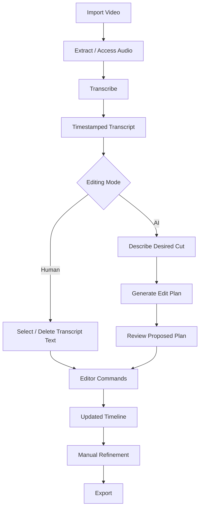
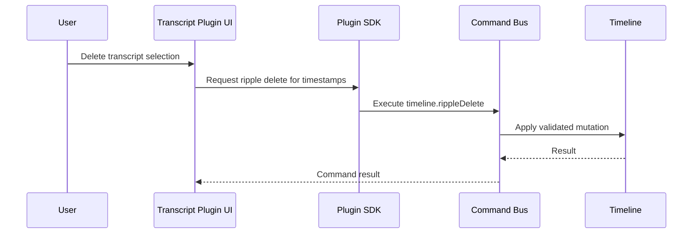
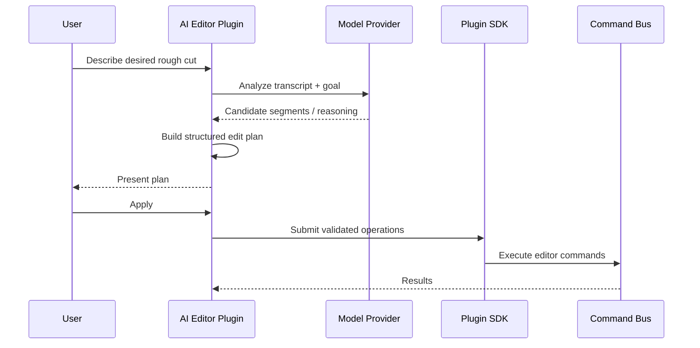

# Transcript Editing Workflow

Status: **Draft / Canonical**

Transcript-based editing is the first end-to-end workflow for the AI Editor plugin.

It is intentionally narrow. Its purpose is to validate the media engine, editor command model, plugin runtime, background jobs, AI provider abstraction, and plugin UI in one coherent user workflow.

## User workflow



## Example

A user imports a 60-minute interview and asks:

> Create a 7-minute rough cut focused on how the guest started the company.

The workflow can:

1. transcribe the source media
2. create timestamped transcript segments
3. index transcript content
4. identify segments related to the user's goal
5. rank and select candidate moments
6. generate a structured edit plan
7. show the proposed plan to the user
8. translate approved operations into editor commands
9. create the rough cut on the timeline
10. return control to the normal editor

## Human transcript editing

AI is not required for every part of the workflow.

The transcript itself should function as an editing interface. Selecting transcript text should seek/select corresponding timeline ranges. Removing a transcript range can produce a timeline command such as a ripple delete.



## AI rough-cut path



## Local and cloud execution

Transcription and reasoning are capabilities, not hard-coded vendors.

```text
Transcription
├── local model
└── optional cloud provider

Reasoning
├── local model
└── optional cloud provider
```

The workflow must remain usable without cloud services when appropriate local models are installed.

## Why this is the first workflow

Transcript editing exercises nearly every important architectural boundary without requiring us to build a complete professional NLE first:

- media access
- timestamp synchronization
- background processing
- plugin-owned UI
- plugin state
- local model execution
- optional network services
- editor events
- editor commands
- undo/redo
- timeline mutation
- human refinement
- export

If this workflow requires privileged internal hacks that a normal plugin cannot perform, that is evidence that the plugin API is incomplete.
